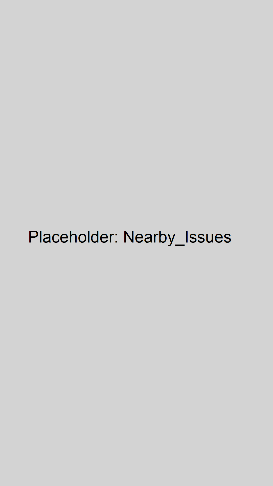
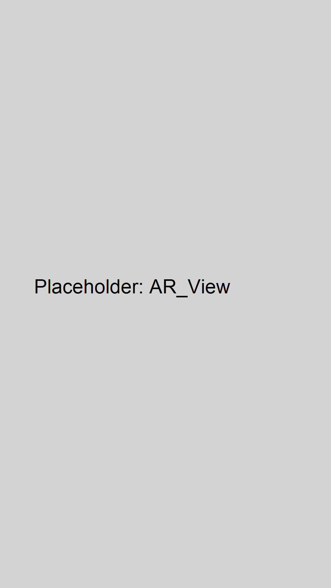
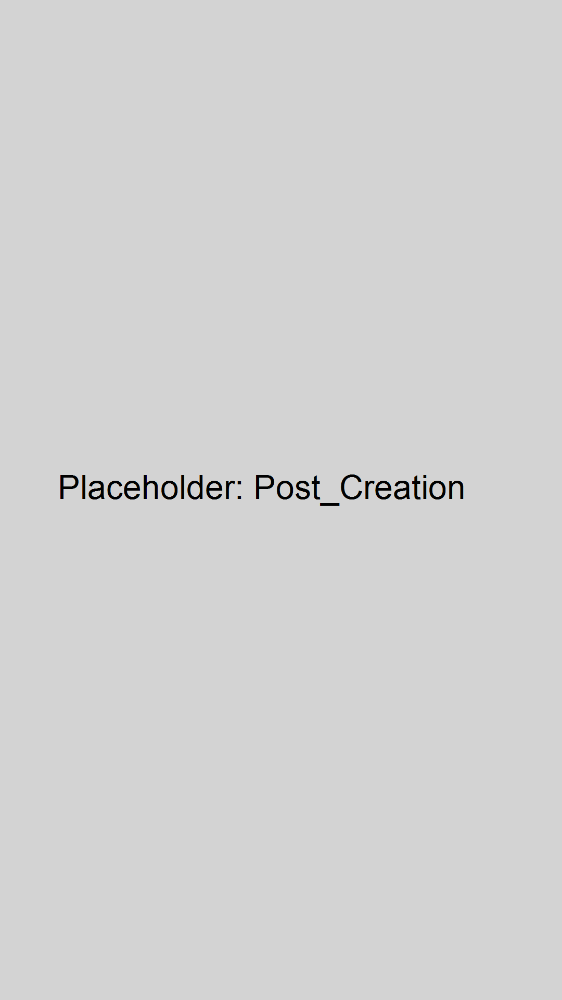
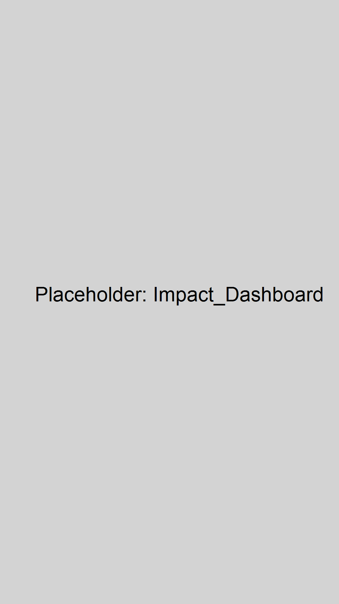
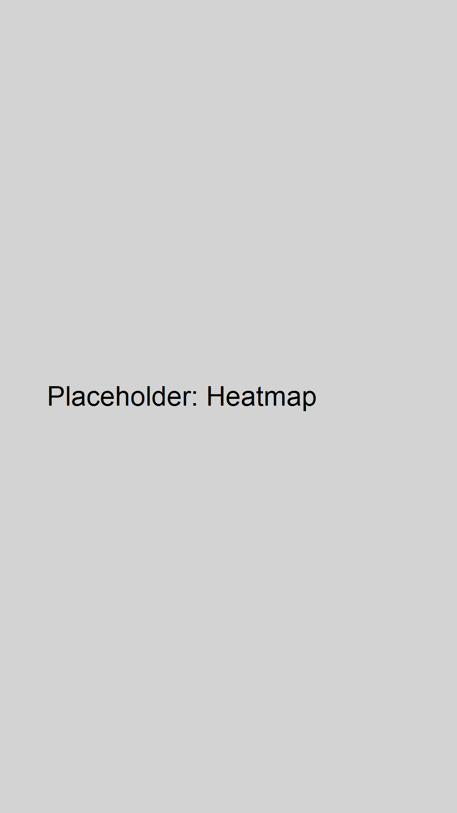

# SafeHer AR — Augmented Reality Women Safety Platform

> **Empowering women with real-time, context-aware safety insights through augmented reality.**


---

## 📖 Table of Contents
1. [Overview](#-overview)
2. [The Problem](#-the-problem)
3. [The Solution](#-the-solution)
4. [Key Features](#-key-features)
5. [How AR Works](#-how-ar-works)
6. [Architecture](#-architecture)
7. [Tech Stack](#-tech-stack)
8. [Installation & Local Build](#-installation--local-build)
9. [Usage / Demo Steps](#-usage--demo-steps)
10. [Privacy & Safety](#-privacy--safety)
11. [Accessibility](#-accessibility)
12. [Tests](#-tests)
13. [Screenshots](#-screenshots)
14. [Developer Notes](#-developer-notes)
15. [License](#-license)

---

## 👁️ Overview
SafeHer AR is an Android application designed to provide women with immediate, actionable safety location data using Augmented Reality. By overlaying community-reported and verified safety hotspots (such as poorly lit areas or harassment zones) directly onto the real world via the smartphone camera, it enables users to make safer navigational choices instantly.

---

## ⚠️ The Problem
Women frequently face safety concerns when navigating cities, especially walking alone or at night. Traditional 2D maps require users to constantly look down, diverting their attention from their physical surroundings, which can reduce situational awareness. Furthermore, standard maps lack hyper-local, real-time safety data reported by the community.

---

## 💡 The Solution
SafeHer AR bridges the gap between digital safety data and the physical world. 
- **AR Labels:** Instead of looking down at a map, users hold up their phone to see spatially-anchored safety alerts directly in their path.
- **Anonymous Reports:** Community-driven reporting allows for rapid identification of safety issues without compromising user identity.
- **Heatmap & SafeRoute (INFERRED — verify):** Identifies macro-level safe zones and algorithms to route users avoiding high-risk areas.
- **TTS/Haptics:** Eyes-free high-risk alerts using text-to-speech and haptics, so a user doesn't even need to look at the screen.

---

## ✨ Key Features
* **AR Safety View:** Overlays safety warnings (e.g., "Poor lighting", "Harassment reported") directly on the camera feed using 2D screen-space tracking tied to compass bearings.
* **Anonymous Incident Reporting:** A step-by-step flow empowering users to drop geotagged safety anchors easily.
* **Impact Dashboard:** Gamifies community contribution by showing local safety impact and successfully verified reports.
* **Interactive Heatmap:** A global view of neighborhood safety scores and reported areas.
* **High-Risk Auto-Alerts:** Proactively uses haptics and Text-to-Speech (TTS) to read out nearby URGENT/HIGH severity issues, ensuring safety without requiring looking at the phone.
* **SOS Integration:** One-tap emergency features pinned within the AR Detail Sheet.

---

## 🔍 How AR Works
SafeHer AR utilizes a custom, lightweight, sensor-driven AR approach optimizing for rapid deployment and accessibility:
- **Device Sensors:** Uses the device's magnetometer and accelerometer to calculate a real-time compass heading.
- **Spatial Mapping:** Safety "Anchors" (lat/lon points) are fetched from the backend and translated into bearing differences relative to the user's current GPS location and heading.
- **Collision-Aware Rendering:** Implemented in `ARViewScreen.kt`, the system projects these bearings as 2D floating UI composables. An efficient radial-push collision algorithm prevents label overlapping, stacking them legibly.
- **CameraX:** Uses standard Android CameraX for the background preview, avoiding the heavyweight dependency and device-limitations of ARCore for simple floating labels.

---

## 🏗 Architecture
SafeHer AR uses a modern, reactive Kotlin Multiplatform/Android architecture.

* **Frontend:** Jetpack Compose (Material 3). Driven by an MVVM pattern (`MainViewModel.kt` passing state down).
* **Location/AR Layer:** FusedLocationProvider tracking user movement; SensorManager parsing device rotation.
* **Data Flow:** Report created → Authenticated via Firebase Auth → Saved to Firestore -> Synced to local Room DB/Flow → Rendered as UI.
* **Backend:** Firebase Firestore (NoSQL Document DB) stores `AnchorData`.

---

## 🛠 Tech Stack
* **Language:** Kotlin
* **UI Toolkit:** Jetpack Compose (Material 3)
* **AR/Camera:** CameraX, SensorManager (Compass/Bearing math)
* **Maps/Location:** Google Play Services Location SDK, osmdroid
* **Backend:** Firebase (Auth, Firestore)
* **Accessibility:** Text-to-Speech (TTS), Compose Semantics

---

## 🚀 Installation & Local Build

### Requirements
- Android Studio Ladybug or newer.
- Android SDK API 34+
- Physical device recommended for Camera/Sensor features.

### Setup
1. Clone the repository to your local machine.
2. **REQUIRED:** Add your `google-services.json` to the `app/` directory (Firebase config is missing from version control for security).
3. Build the project locally:
   ```bash
   ./gradlew assembleDebug
   ```
4. Install the APK on your device or emulator.

---

## 📱 Usage / Demo Steps
1. **Launch App:** Open SafeHer AR. Grant Location and Camera permissions when prompted.
2. **Onboarding:** Swipe through the introductory screens.
3. **AR View:** Tap the AR/Camera tab to open the viewfinder. Spin around to see default or generated safety anchors floating in space.
4. **Detail Sheet:** Tap an `ARInlineLabel` to slide up the details sheet and view the 300-word context, risk level, and action buttons.
5. **Post a Report:** Use the central "+" fab to open the creation flow and place a new anchor nearby.
6. **Heatmap:** Switch to the Map tab to view the density of local safety incidents.

---

## 🔒 Privacy & Safety
Protecting users is paramount for a women's safety app:
* **Anonymous Reporting:** No Personal Identifiable Information (PII) is attached to public anchor data. Profiles are strictly abstract.
* **Data Flow Constraints:** Only abstract location coordinates (`lat`/`lon`) and categorized strings are transmitted.
* **Recommended Improvement:** Implement geohash bucketing or fuzzy locations for medium-risk items to prevent precise user tracking.

---

## ♿ Accessibility
SafeHer AR is built with inclusivity in mind:
* **Text-to-Speech (TTS):** Automatically reads out High/Urgent threats if the user is within 200m.
* **Haptics:** Long-press vibration patterns preempt spoken alerts.
* **Screen Reader:** Comprehensive `contentDescription` mappings for all complex Compose UI components (AR labels, sheets, buttons).
* **High Contrast UI:** Verified contrast ratios across the custom light translucent styling.

---

## 🧪 Tests
To run the automated test suite locally:
```bash
# Run unit tests
./gradlew testDebugUnitTest

# Run connected Android UI tests (requires running emulator/device)
./gradlew connectedAndroidTest
```

---

## 🖼 Screenshots

| Nearby Issues | AR View | Detail Sheet |
|:---:|:---:|:---:|
|  |  |  |
| Impact Dashboard | Heatmap / Map | Onboarding |
|  |  |  |

---

## 💻 Developer Notes
- **Design Tokens:** Extracted to `work/artifacts/design-tokens.json` mapping colors (Soft Off-White `#FFF7FA` bg), typography, and shapes.
- **Fonts:** Custom fonts located at `app/src/main/res/font/` (`poppins_semi_bold.ttf`, `inter_variable.ttf`).
- **AR Labels:** Logic specifically isolated in `ARViewScreen.kt` using `ARInlineLabel`. Requires a physical compass/magnetometer to test rotation accuracy accurately. 

---

## 🤝 Contribution
This project is currently under local verification and documentation for hackathon submission. Please DO NOT push or modify source code during this phase.

## 📄 License
No license file found — add LICENSE to declare usage.
